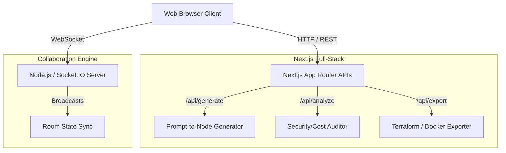

<h1 align="center">
  Architectural Whiteboard
</h1>

<p align="center">
  <strong>An AI-powered, real-time collaborative cloud architecture designer.</strong>
</p>

<p align="center">
  
  
  
  
</p>

## Overview

Architectural Whiteboard is a modern, enterprise-grade web application designed for Cloud Architects, DevOps Engineers, and Software Developers. It allows teams to visually design cloud infrastructure on an interactive canvas, collaborate in real-time, generate architectures using Natural Language Processing (NLP), and export diagrams directly into Infrastructure as Code (IaC) templates.

## ✨ Features

- **Real-Time Collaboration**: Built with `Socket.IO`, multiple users can join a room and edit the architecture concurrently. You can see other users' cursors moving in real-time.
- **AI Architecture Generation**: Describe your desired system (e.g., *"E-commerce backend with Kafka, Redis, PostgreSQL, and an API Gateway"*) and the AI will auto-generate the components and connections on the canvas.
- **AI Security & Cost Audit**: Click the "AI Analyze" button to receive an instant audit of your architecture. The system detects Single Points of Failure (SPOFs), security vulnerabilities (like unencrypted HTTP or exposed databases), performance bottlenecks, and provides a monthly AWS cost estimate.
- **Infrastructure as Code (IaC) Export**: One-click export of your visual diagram into:
  - **Terraform (`.tf`)**
  - **Docker Compose (`.yml`)**
  - **Mermaid.js Diagrams**
- **Modern Glassmorphic UI**: Beautiful, dark-themed UI built with React Flow, customized with dynamic node rendering, status LEDs, and animated HTTPS/gRPC data flows.

## 🏗️ Architecture



## 🚀 Getting Started

This project is configured as a zero-config, out-of-the-box local environment.

### Prerequisites

- Node.js (v18 or higher)
- npm or yarn
- Redis (optional for local dev — rooms fall back to in-memory state)

### Installation

1. Clone the repository:
   ```bash
   git clone https://github.com/yourusername/architectural-whiteboard.git
   cd architectural-whiteboard
   ```

2. Install dependencies:
   ```bash
   npm install
   ```

3. Set up environment variables:
   ```bash
   cp .env.example .env.local
   # Edit .env.local with your Supabase and AI provider keys
   ```

4. Start the development server (This uses `concurrently` to boot both Next.js and the Socket.IO server automatically):
   ```bash
   npm run dev
   ```

5. Open [http://localhost:3000](http://localhost:3000) in your browser.

## 🛠️ Tech Stack

- **Frontend**: Next.js 16 (App Router), React, React Flow (for canvas rendering), Vanilla CSS (Glassmorphism), Lucide React (Icons).
- **Backend (API)**: Next.js Route Handlers (`/api/...`) for stateless processing, AI generation, and IaC conversion.
- **Backend (Real-time)**: Express.js + Socket.IO (running on port 4002) for low-latency WebSocket cursor tracking and state synchronization.

## 🤝 Contributing

Contributions, issues, and feature requests are welcome!
Feel free to check the [issues page](https://github.com/yourusername/architectural-whiteboard/issues).

## 📝 License

This project is [MIT](https://opensource.org/licenses/MIT) licensed.
